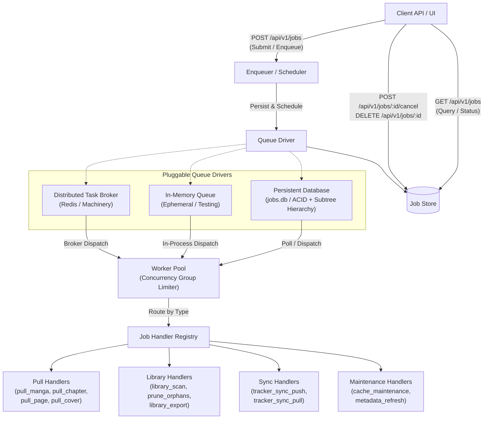
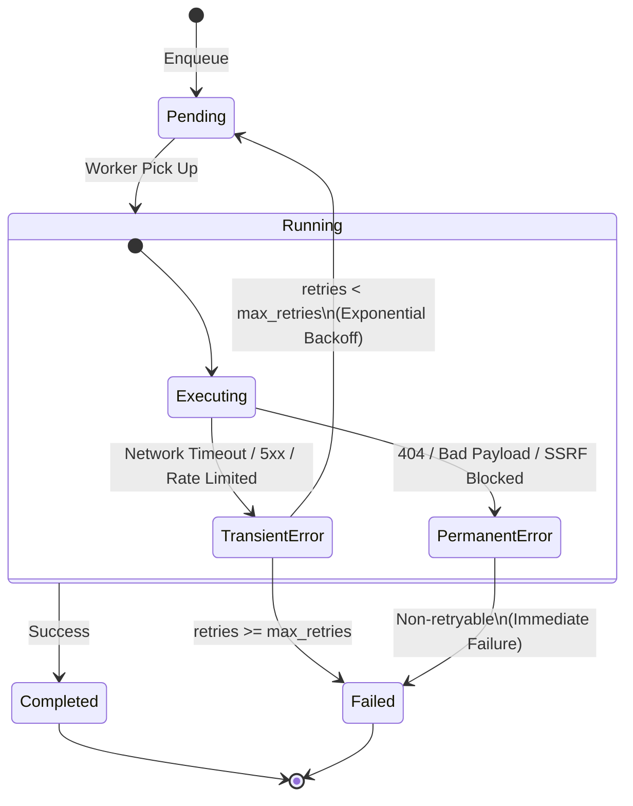

# Generic Background Job Queue System

## Overview

Kiyomi utilizes a generic, extensible **Background Job Queue** capable of scheduling and executing asynchronous tasks. While the content acquisition pipeline is a primary consumer, the job queue engine is decoupled from pull-specific logic to power general background tasks, including library maintenance, metadata enrichment, cache eviction, and external tracking synchronization.

---

## 1. Core Architecture

The background processing system consists of an API layer, a scheduler/enqueuer, a pluggable persistent job store, a queue worker pool, and registered job handlers.



### High-Level Component Abstractions

- **`JobStore`**: Persistence layer managing job lifecycle states, querying with hierarchical filtering, cascading cancellations, and retention pruning.
- **`Enqueuer`**: Scheduling interface through which client handlers and child jobs are submitted for execution.
- **`Worker`**: Execution engine responsible for pulling tasks from the queue, enforcing per-group concurrency limits, invoking registered handlers, managing retries, and recording results.
- **`JobHandler`**: Task execution callback mapped to a specific job `type`.

---

## 2. Conceptual Job Schema

All background jobs share a unified schema supporting parent-child hierarchy, queryable metadata tags, structured error diagnostics, and scoped concurrency groups.

### Field Definitions

| Field | Type | Nullable | Description |
| :--- | :--- | :--- | :--- |
| `id` | string (UUID) | No | Unique identifier for the job. |
| `parent_id` | string (UUID) | Yes | Identifier of the parent job. Null for top-level root jobs. |
| `type` | string | No | Task type identifier mapping to a registered handler (e.g., `pull_manga`, `pull_page`). |
| `payload` | string (JSON) | No | Serialized JSON payload containing task-specific execution arguments. |
| `status` | string | No | Current lifecycle state: `pending`, `running`, `completed`, `failed`. |
| `retries` | integer | No | Number of retry attempts executed so far. |
| `max_retries` | integer | No | Maximum retry attempts allowed before permanent failure. |
| `concurrency_group` | string | No | Group key used to enforce scoped concurrency limits (e.g., `pull:mangadex`, `pull:cover`). |
| `error` | string | Yes | Diagnostic error message recorded upon failure. |
| `created_at` | timestamp (ISO 8601) | No | Timestamp when the job was created and queued. |
| `updated_at` | timestamp (ISO 8601) | No | Timestamp of the most recent status or progress update. |
| `started_at` | timestamp (ISO 8601) | Yes | Timestamp when worker execution began. |
| `completed_at` | timestamp (ISO 8601) | Yes | Timestamp when the job entered a terminal state (`completed` or `failed`). |
| `child_count` | integer | No | Dynamically computed count of direct child jobs spawned by this job. |
| `metadata` | map[string]string | No | Queryable key-value tags (e.g., `manga_id`, `provider_id`, `chapter_id`, `page_index`). |

### JSON Schema Representation

```json
{
  "id": "8f3b6c2a-9e12-4d57-b184-fa6d7e29c0a1",
  "parent_id": "3d2a1c0b-4f5e-6a7b-8c9d-0e1f2a3b4c5d",
  "type": "pull_page",
  "payload": "{\"manga_id\":\"01HGW1...\",\"provider_id\":\"mangadex\",\"chapter_id\":\"ch01\",\"page_index\":1,\"page_url\":\"https://example.com/1.jpg\"}",
  "status": "completed",
  "retries": 0,
  "max_retries": 3,
  "concurrency_group": "pull:mangadex",
  "error": "",
  "created_at": "2026-08-31T05:00:00Z",
  "updated_at": "2026-08-31T05:00:02Z",
  "started_at": "2026-08-31T05:00:01Z",
  "completed_at": "2026-08-31T05:00:02Z",
  "child_count": 0,
  "metadata": {
    "manga_id": "01HGW1...",
    "provider_id": "mangadex",
    "chapter_id": "ch01",
    "page_index": "1"
  }
}
```

---

## 3. Queue Driver Implementations

Kiyomi abstracts the underlying queue transport and storage, enabling different operational environments:

### A. Persistent / Embedded Database Queue (`jobs.db`)

The default driver for standalone instances. It isolates background task persistence from the main library database to avoid write contention.

- **Dedicated Database File**: Stored in an isolated database file (e.g. `jobs.db`).
- **ACID Reliability**: Guarantees transaction isolation, atomic state transitions, and crash resilience.
- **Crash Recovery**: During startup, tasks stranded in `running` state due to an unexpected shutdown or crash are automatically transitioned back to `pending` (or marked `failed` if retry limits are exhausted).
- **Parent-Child Hierarchy**: Tracks recursive parent-child job trees. Cascading cancellations and deletions clean up entire execution trees atomically.

### B. Ephemeral In-Memory Queue

A lightweight queue driver for in-memory task execution without disk persistence.

- **Ephemeral**: State exists only in memory; zero disk writes.
- **Usage**: Used for unit and integration testing, CLI dry-runs, or memory-only installations.
- **Concurrency**: Manages queue distribution via in-process synchronization and worker channels.

### C. Distributed Task Broker

An adapter integrating with external task brokers (e.g., Redis via Machinery) for multi-node scaling.

- **Multi-Node Scaling**: Allows offloading intensive background workloads (such as media transcoding or bulk crawling) to dedicated worker instances.
- **Broker & Result Backend**: Connects to message brokers for task delivery and result inspection across a distributed cluster.

---

## 4. Error Classification & Retry Policy

The queue system distinguishes between transient failures and non-recoverable permanent errors:



### Error Types

1. **Transient Errors**:
   - *Causes*: Network timeouts, upstream HTTP 5xx responses, rate limiting, temporary connection resets.
   - *Handling*: The worker increments `retries` and re-queues the job with exponential backoff delay until `max_retries` is reached.
2. **Permanent Errors**:
   - *Causes*: Upstream HTTP 404 (Not Found), HTTP 400/401/403/410, invalid JSON payloads, missing mandatory parameters, SSRF security violations.
   - *Handling*: Handlers classify the failure as non-recoverable. The worker transitions the job directly to `failed` without consuming remaining retries or delaying the queue.

---

## 5. Concurrency Groups & Rate Limiting

To protect external upstream services and local disk I/O from overload:

- **Concurrency Group Keys**: Every job is assigned a concurrency group key:
  - `pull:<provider_id>`: Throttles concurrent requests directed at a specific provider (e.g. `pull:mangadex`).
  - `pull:cover`: Dedicated bucket for cover image downloads, preventing cover fetches from consuming chapter page bandwidth.
- **Per-Group Worker Limits**: The worker pool restricts active concurrent jobs per group matching upstream rate limits.
- **Entity Coordination**: For multi-step batch operations (e.g. `pull_manga`), coordination per entity ID prevents duplicate child jobs during concurrent requests.

---

## 6. Automatic Retention Pruning & Cleanup

To prevent unbounded storage growth, the queue engine executes periodic background cleanup:

- **Retention Thresholds**: Configurable time-to-live (TTL) thresholds for jobs with `status = completed` and `status = failed`, processed in bounded cleanup batches.
- **Subtree Integrity Guarantee**:
  - Pruning evaluates the state of entire job trees.
  - A root job is only eligible for cleanup when **all** child and descendant jobs have reached terminal states (`completed` or `failed`) and satisfy the respective retention cutoff.
  - Deletion cascades across the root task and all associated descendant records and metadata.

---

## 7. REST API

The background job queue exposes endpoints for task management and monitoring under `/api/v1/jobs`.

### Endpoints

| Method | Path | Description |
| :--- | :--- | :--- |
| `GET` | `/api/v1/jobs` | Query jobs with filtering by status, type, parent hierarchy, and metadata tags. |
| `POST` | `/api/v1/jobs` | Enqueue a new background job. |
| `POST` | `/api/v1/jobs/:id/cancel` | Cancel an active or queued job and cascade cancellation to all child jobs. |
| `DELETE` | `/api/v1/jobs/:id?action=cancel` | Alternate method for cancelling a job and its child jobs. |
| `DELETE` | `/api/v1/jobs/:id` | Permanently remove a job and its child jobs from the store. |
| `DELETE` | `/api/v1/jobs` | Batch clean up completed or failed jobs matching query parameters. |

### Query Parameters for `GET /api/v1/jobs`

- `status`: Filter by status (`pending`, `running`, `completed`, `failed`).
- `type`: Filter by job type (e.g., `pull_page`, `pull_manga`).
- `parent_id`: Filter by direct parent ID.
- `all`: If `true` (or `parent_id=all`), returns all jobs regardless of parent hierarchy. When omitted, queries return top-level root jobs (`parent_id IS NULL`).
- `metadata.<key>`: Match exact metadata tags (e.g. `?metadata.manga_id=01HGW1...&metadata.provider_id=mangadex`).

### Query Parameters for `DELETE /api/v1/jobs`

- `status`: Target statuses to prune (`completed`, `failed`, `finished`, or comma-separated list `completed,failed`). Defaults to `completed`.

---

## 8. Common Task Types & Handler Registry

| Category | Job Type | Description |
| :--- | :--- | :--- |
| **Content Pull** | `pull_manga` | Reconciles chapter list against provider and enqueues chapter pulls. |
| | `pull_chapter` | Resolves page manifest for a chapter and enqueues page pulls. |
| | `pull_page` | Downloads single page image, validates SSRF, checks cache, and writes to disk. |
| | `pull_cover` | Fetches manga cover image, validates SSRF, and stores at manga root. |
| **Library Maintenance** | `library_scan` | Inspects directory hierarchy, validates manifest integrity, and fixes numbering gaps. |
| | `prune_orphans` | Removes empty or unreferenced directories from the library storage. |
| | `library_export` | Archives downloaded chapter folders into standard `.cbz` archives. |
| **Metadata & Media** | `metadata_refresh` | Fetches updated ratings, tags, and descriptions from metadata providers. |
| | `media_optimization`| Transcodes or compresses stored images (e.g. PNG to WebP) for disk efficiency. |
| **Tracker Sync** | `tracker_sync_push`| Asynchronously sends reading progress updates to external tracking platforms. |
| | `tracker_sync_pull`| Imports external list changes and reading state into the local library. |
| **Cache & Prefetch** | `cache_maintenance`| Evicts expired items from the temporary image cache based on TTL and LRU limits. |
| | `chapter_prefetch` | Predictively pre-fetches page URLs for subsequent chapters during active reading. |
