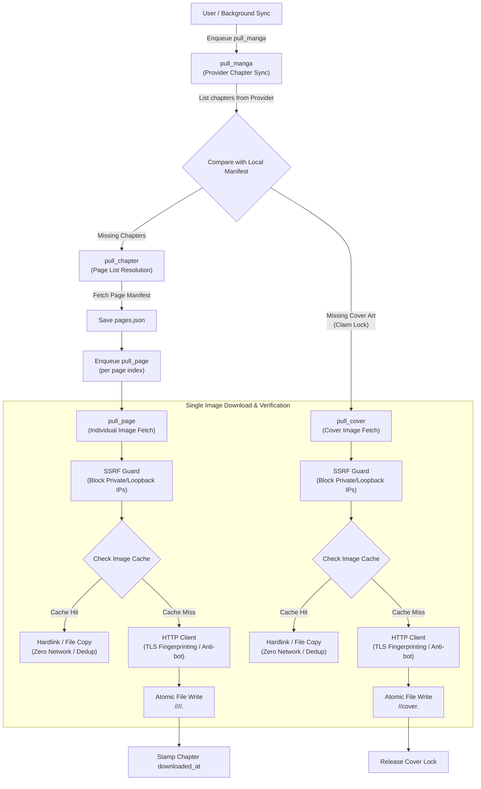

# Content Acquisition & Pull Pipeline

## Overview

The **Content Pull System** orchestrates the retrieval of manga metadata, chapter lists, page images, and cover art from external upstream providers into Kiyomi's local filesystem-first library. Built on top of the [Generic Background Job Queue](./background_jobs.md), the pull pipeline operates as a granular, multi-tiered hierarchy of asynchronous tasks with strict rate-limiting, SSRF security validation, cache deduplication, and atomic filesystem persistence.

---

## 1. Pull Naming Rationale

"Pull" is used instead of "download" to distinguish server-to-upstream acquisition from client-initiated downloads:
- **Download**: Implies a client device is retrieving files from the Kiyomi server.
- **Pull**: Conveys that the Kiyomi server is fetching content from an upstream provider into its local storage, clarifying data flow direction for users and API consumers.

---

## 2. Pipeline Hierarchy & Flow

The content pull pipeline decomposes manga acquisition into distinct, specialized jobs that cascade down from the manga level to individual page files:



---

## 3. Pull Operations Specification

### A. `pull_manga` (Provider Reconciliation)

Reconciles the chapter list and cover art for a manga from the designated content provider.

- **Concurrency Group**: `pull:<provider_id>`
- **Payload Schema**:
  ```json
  {
    "manga_id": "01HGW1...",
    "provider_id": "mangadex",
    "provider_manga_id": "a1b2c3d4",
    "cover_url": "https://uploads.mangadex.org/covers/..."
  }
  ```
- **Execution Flow**:
  1. Queries the provider's `FetchChapters` API using `provider_manga_id`.
  2. Acquires an entity lock for `manga_id` to prevent concurrent reconciliations from creating duplicate tasks.
  3. Compares provider chapters against local chapters in `<library_root>/<manga_id>/<provider_id>/`.
  4. For each missing chapter, creates chapter metadata (`meta.json`) and enqueues a child `pull_chapter` job.
  5. If `cover_url` is provided and the manga does not have a cover on disk, attempts to acquire the cover acquisition lock. If acquired, enqueues a child `pull_cover` job.
  6. Updates `content.last_synced_at` in `bindings.json` (the bindings concern file only).

### B. `pull_chapter` (Page Manifest Resolution)

Resolves the full list of page URLs for a specific chapter and persists the chapter page manifest.

- **Concurrency Group**: `pull:<provider_id>`
- **Payload Schema**:
  ```json
  {
    "manga_id": "01HGW1...",
    "provider_id": "mangadex",
    "chapter_id": "ch_001"
  }
  ```
- **Execution Flow**:
  1. Resolves provider chapter reference and provider manga reference from chapter/manga manifests.
  2. Queries the provider's `FetchPages` API to obtain the ordered list of page URLs.
  3. Persists the resolved list to `pages.json` in the chapter directory.
  4. Enqueues a child `pull_page` job for every page index in the resolved list, tagging each with metadata (`manga_id`, `provider_id`, `chapter_id`, `page_index`).

### C. `pull_page` (Single Page Acquisition)

Downloads a single page image file and saves it to the chapter's filesystem storage.

- **Concurrency Group**: `pull:<provider_id>`
- **Payload Schema**:
  ```json
  {
    "manga_id": "01HGW1...",
    "provider_id": "mangadex",
    "chapter_id": "ch_001",
    "page_index": 1,
    "page_url": "https://example.com/data/001.jpg"
  }
  ```
- **Execution Flow**:
  1. Validates `page_url` using the SSRF Guard. If blocked, returns a permanent error.
  2. Checks the ephemeral image cache for `page_url`. If cached, links or copies the file directly to the target destination without network overhead.
  3. If not cached, fetches the image via the HTTP client (applying TLS fingerprinting, custom user-agent, session headers, and referrers).
  4. Detects image extension from URL path and HTTP `Content-Type` header (defaults to `.jpg`).
  5. Atomically writes the page image to `<page_index>.<ext>`.
  6. Updates the chapter's `downloaded_at` timestamp in `meta.json` under the manga entity lock.

### D. `pull_cover` (Canonical Cover Acquisition)

Downloads the manga's primary cover art and stores it at the root of the manga folder.

- **Concurrency Group**: `pull:cover`
- **Payload Schema**:
  ```json
  {
    "manga_id": "01HGW1...",
    "cover_url": "https://example.com/covers/cover.jpg",
    "provider_id": "mangadex"
  }
  ```
- **Execution Flow**:
  1. Validates `cover_url` using the SSRF Guard.
  2. Checks image cache for existing cached asset; links or copies if available.
  3. Otherwise, fetches cover image via the HTTP client.
  4. Atomically writes image to `<library_root>/<manga_id>/cover.<ext>`.
  5. Releases the cover acquisition lock upon completion (or failure).

---

## 4. Storage Hierarchy & Manifests

Content is organized under a multi-provider directory layout:

```
<library_root>/
└── <manga_id>/
    ├── metadata.json                 # Provider metadata (title, description, authors, tags, cover_url)
    ├── user_state.json               # User reading state (status, rating, favorite, notes, last_read_chapter_id)
    ├── bindings.json                 # Provider bindings list and active content source pointer
    ├── cover.<ext>                   # Manga cover image
    └── <provider_id>/                # Provider namespace (e.g. mangadex, local)
        └── <chapter_id>/             # Local chapter directory
            ├── meta.json             # Chapter metadata (number, title, download status)
            ├── pages.json            # Resolved page manifest
            ├── 0.jpg                 # Page images (<page_index>.<ext>)
            ├── 1.jpg
            └── ...
```

### Chapter Page Manifest (`pages.json`)

```json
[
  {
    "index": 0,
    "url": "https://uploads.mangadex.org/data/ch1/0.jpg",
    "source": "provider"
  },
  {
    "index": 1,
    "url": "https://uploads.mangadex.org/data/ch1/1.jpg",
    "source": "provider"
  }
]
```

---

## 5. Security & SSRF Protection

All outbound HTTP requests for pages and covers pass through a dedicated **SSRF Guard**:

- **Target Address Validation**: Blocks outbound requests targeting private IP networks, loopback addresses, link-local ranges, cloud metadata address spaces, shared address space (CGNAT), and multicast or unspecified address ranges.
- **DNS Resolution & Rebinding Protection**: Resolves hostnames with a bounded timeout and inspects all resolved IP addresses before initiating connections to guard against DNS rebinding attacks.
- **Configurable Network Restrictions**: Supports configuration overrides for testing against local mock servers or development environments.
- **Error Propagation**: SSRF violations are classified as permanent errors, aborting retries immediately.

---

## 6. Ephemeral Image Cache Integration

Kiyomi integrates an ephemeral image cache with the pull pipeline:

1. **Deduplication Between Stream & Pull**: If a user reads a chapter online (populating the image cache), a subsequent "Pull Chapter" action checks the cache before issuing network requests.
2. **Filesystem Linking Optimization**: If the cache and library reside on the same filesystem volume, the pull worker links the cached file directly to the library target path. This eliminates network bandwidth and avoids consuming duplicate disk space.
3. **File Copy Fallback**: If linking is unavailable across storage boundaries or filesystem types, the worker falls back to an atomic file copy.

---

## 7. Concurrency, Throttling & Locking

To prevent upstream provider rate-limit bans and race conditions:

| Mechanism | Target | Behavior |
| :--- | :--- | :--- |
| **Provider Concurrency Group** (`pull:<provider_id>`) | `pull_manga`, `pull_chapter`, `pull_page` | Limits active concurrent requests per provider according to provider rate limits. |
| **Cover Concurrency Group** (`pull:cover`) | `pull_cover` | Dedicated rate bucket to avoid competing with or starving page downloads. |
| **Manga Entity Lock** | `pull_manga`, `pull_page` | Serializes metadata updates and prevents duplicate child job creation for the same manga. |
| **Cover Acquisition Lock** | `pull_cover` | Atomic locking ensuring only one cover pull is enqueued at a time per manga. |

---

## 8. Error Classification & Resilience

The pull pipeline maps upstream responses to job queue error policies:

| Upstream Status / Condition | Classification | Behavior |
| :--- | :--- | :--- |
| HTTP 200 OK | Success | File written atomically, manifest timestamp updated. |
| HTTP 400, 401, 403, 404, 410 | Permanent | Job marked `failed` immediately; retries aborted. |
| SSRF Violation | Permanent | Job marked `failed` immediately; retries aborted. |
| Malformed Payload / Missing Fields | Permanent | Job marked `failed` immediately; retries aborted. |
| HTTP 429 (Too Many Requests), 5xx | Transient | Exponential backoff retry up to `max_retries`. |
| Network Timeout / Socket Error | Transient | Exponential backoff retry up to `max_retries`. |

